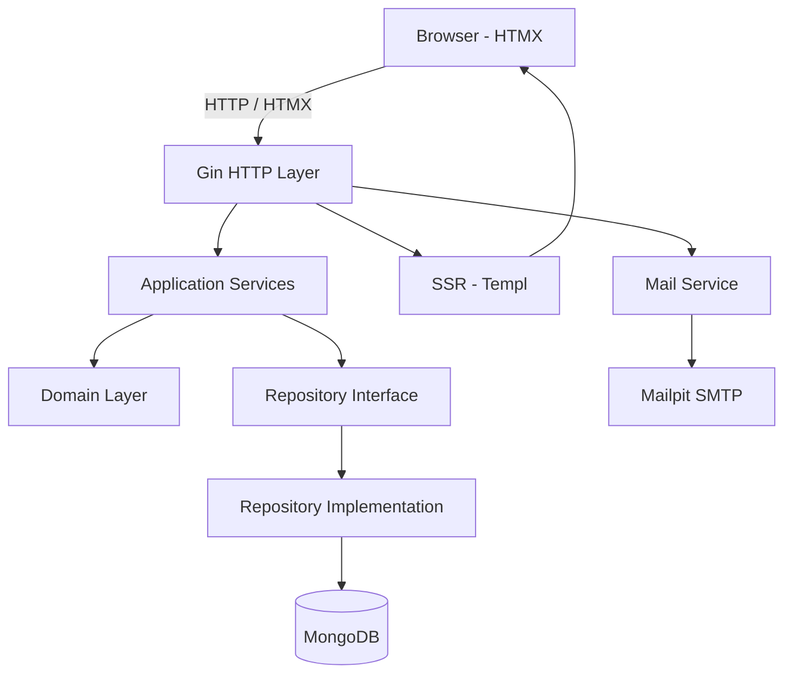
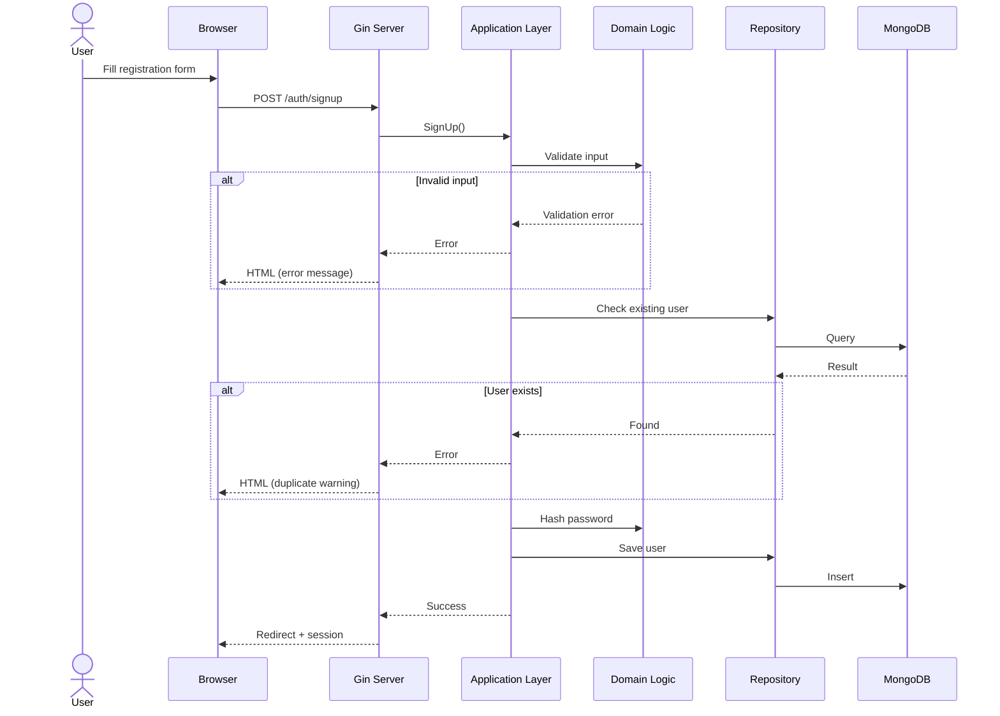
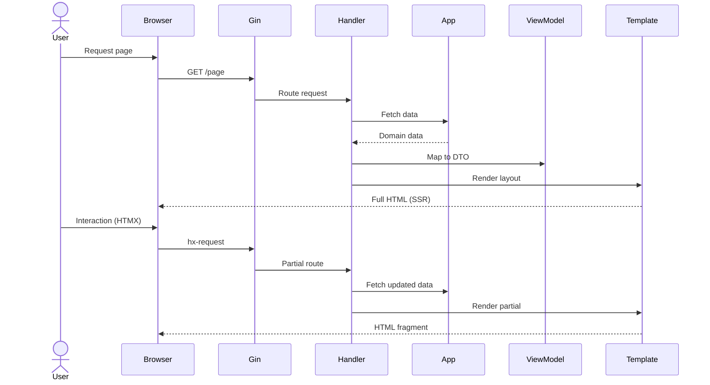

# Fighting Fantasy

Web-based single-player RPG inspired by the classic gamebook *"The Forest of Doom"*.

---

## 📌 Overview

Fighting Fantasy is a backend-driven web application that recreates the experience of a solo adventure gamebook. The system manages narrative flow, player decisions, and game state, delivering dynamic content through server-side rendering.

The project focuses on backend architecture, domain modeling, and clean separation of concerns.

---

## 🧠 Architecture & Design

The application is built using **Domain-Driven Design (DDD)** and **Clean Architecture**, ensuring clear separation between business logic and delivery layers.

### Layers:

* **Domain:** core game rules and decision logic
* **Application:** use case orchestration
* **Infrastructure:** database and external services
* **Interface:** HTTP handlers (Gin), SSR and API

The system supports multiple interfaces:

* Server-Side Rendering (SSR)
* Internal REST API

Both interfaces are decoupled from the domain layer.

---

## 🧭 Architecture Diagram (High-Level)



---

## ⚙️ Tech Stack

* **Backend:** Go (Gin)
* **Rendering:** Templ + HTMX
* **Database:** MongoDB
* **Infrastructure:** Docker, Docker Compose
* **Architecture:** DDD + Clean Architecture

---

## 🚀 Features

* Dynamic narrative rendering based on player choices
* Structured persistence of branching story data in MongoDBe
* Server-side rendering with HTMX for interactivity
* Clean and modular architecture
* Containerized environment for development and production
* Email confirmation flow with local testing support (Mailpit)

---

## 🔄 User Registration Flow



---

## 🔄 Rendering Flow (Advanced - SSR + HTMX)



---

## 🧪 Local Development (Easy Setup)

The project includes a **Makefile** to simplify environment management.

### Start development:

```bash
make dev
```

### Rebuild:

```bash
make dev-build
```

### Stop:

```bash
make dev-down
```

### Logs:

```bash
make dev-logs
```

---

## 📬 Email Testing with Mailpit

To simplify testing, the project includes **Mailpit**, a local SMTP server.

* SMTP: `localhost:1025`
* Web UI: `http://localhost:8025`

All emails are captured locally, allowing full testing without real email accounts.

---

## 🛠️ Running manually (Docker)

```bash
git clone https://github.com/rodrigodip/fighting-fantasy.git
cd fighting-fantasy
docker compose up --build
```

Application:

```
http://localhost:8080
```

---

## 📂 Project Structure

```
/cmd            # Application entrypoint
/internal       # Domain, services, repositories
/templates      # SSR templates (Templ)
/static         # Static assets
```

---

## 📐 Architectural Decisions

* Migration from REST API to SSR to simplify client complexity
* Use of HTMX to avoid heavy frontend frameworks
* Layered architecture to isolate domain logic
* Local email testing via Mailpit to improve development workflow

---

## 💡 Motivation

Inspired by *"A Floresta da Destruição"*, a book that influenced my early interest in games and storytelling.

This project was built as a practical way to explore backend engineering concepts.
